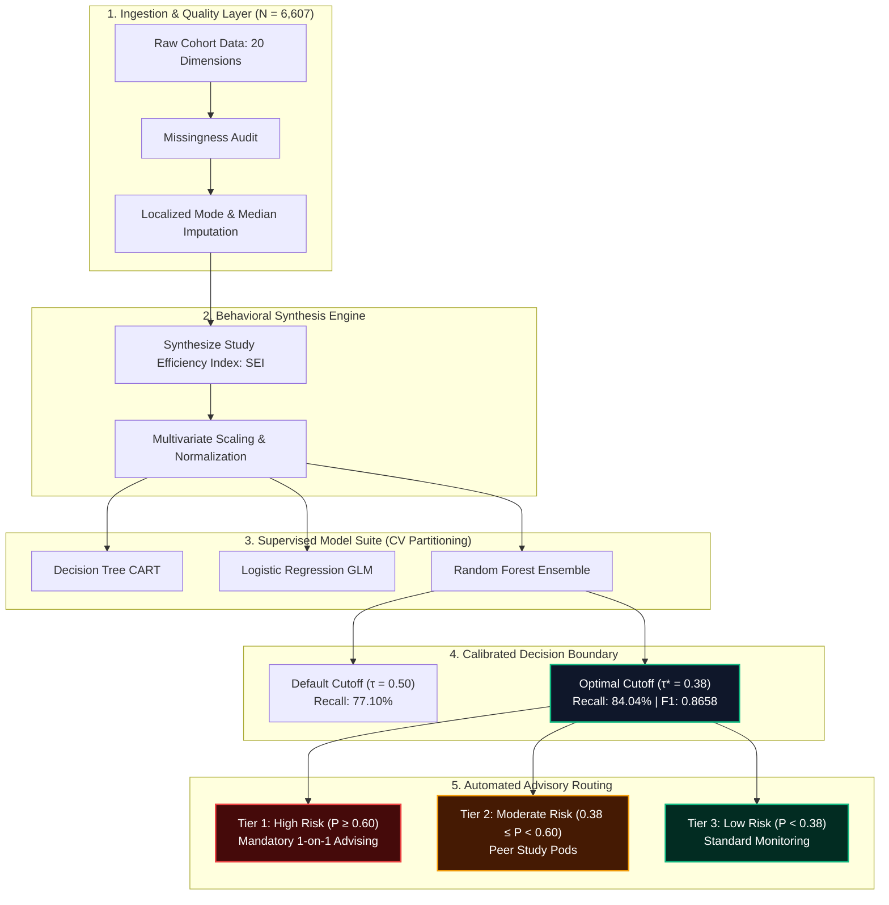

<div align="center">

<pre align="center">
  ██████╗ ██████╗  █████╗ ██████╗ ███████╗██╗      █████╗ 
 ██╔════╝ ██╔══██╗██╔══██╗██╔══██╗██╔════╝██║     ██╔══██╗
 ██║  ███╗██████╔╝███████║██║  ██║█████╗  ██║     ███████║
 ██║   ██║██╔══██╗██╔══██║██║  ██║██╔══╝  ██║     ██╔══██║
 ╚██████╔╝██║  ██║██║  ██║██████╔╝███████╗███████╗██║  ██║
  ╚═════╝ ╚═╝  ╚═╝╚═╝  ╚═╝╚═════╝ ╚══════╝╚══════╝╚═╝  ╚═╝
 ─────────────────────────────────────────────────────────
  GRADient Evaluation & Learned Academic Performance Radar 
 ─────────────────────────────────────────────────────────

                ┌── [ PREDICTION TELEMETRY ENGINE ] ──┐
                │                                     │
    [ INPUT VECTORS ]             [ DUAL NEURAL NODES ]     [ RISK RADAR ]
    ┌───────────────┐                  ╭───╮                .---.
    │ Attendance ───┼───────────╮     (  N1 )────╮         /  ▲  \
    │ Study SEI ────┼──────╮    ╰────▶ ╰───╯     │        |  / \  |
    │ Sleep Var ────┼───╮  │            ╭───╮     ├───▶   /  / τ* \ \
    │ Milestones ───┼─╮ │  ╰─────────▶(  N2 )────╯      |  / 0.38 \ |
    └───────────────┘ │ │              ╰───╯             \ '-----' /
                      ▼ ▼                                  '-------'
            ┌──────────────────┐                     CALIBRATED GAUGES
            │ [||||||||||....] │ 84.04% SENSITIVITY     [OK] [WARN] [CRIT]
            └──────────────────┘                     └───┴──────┴────┘
</pre>

<p align="center">
  
</p>

<p align="center">
  <b>An end-to-end predictive machine learning framework developed in R to shift institutional advising from retroactive post-exam grading to proactive, early-term telemetry.</b>
</p>

<p align="center">
  <a href="#-system-overview"></a>
  <a href="#-architecture--pipeline"></a>
  <a href="#-empirical-evaluation--benchmarks"></a>
  <a href="#-empirical-evaluation--benchmarks"></a>
  <a href="#-decision-boundary-tuning"></a>
  <a href="#-license"></a>
</p>

<p align="center">
  <a href="#-system-overview">System Overview</a> •
  <a href="#-architecture--pipeline">Architecture &amp; Pipeline</a> •
  <a href="#-feature-synthesis-study-efficiency-index-sei">Feature Synthesis</a> •
  <a href="#-empirical-evaluation--benchmarks">Empirical Results</a> •
  <a href="#-behavioral-impact--feature-importance">Feature Importance</a> •
  <a href="#-risk-stratification--advising-protocols">Advising Protocols</a> •
  <a href="#-quickstart--usage">Quickstart</a> •
  <a href="#-collaborators">Collaborators</a>
</p>

---

</div>

## 📌 System Overview

Most academic early-warning systems suffer from an institutional **latency flaw**: alerts trigger *after* midterms or assignment deadlines have failed, leaving minimal runway for recovery.

**GRADELA** shifts performance evaluation directly upstream into the opening weeks of the academic semester:

- 🎯 **Cohort Scale:** Benchmarked on **6,607 student records** spanning **20 multidimensional telemetry vectors**.
- 🔍 **Target Condition:** Early isolation of students likely to fall into the lower quartile ($\text{Exam Score} \le 65$).
- 🎛️ **Optimized Detection:** Decision cutoff recalibrated from the conventional $0.50$ baseline down to **$\tau^* = 0.38$**, capturing **84.04% of at-risk students** ($F_1 = 0.8658$) with an overall **ROC-AUC of 0.976**.
- 💡 **Actionable Focus:** Over **66% of outcome variance** is governed by modifiable behavioral routines (attendance cadence, study efficiency) rather than fixed demographic background.

---

## 🏗️ Architecture & Pipeline

```text
+---------------------------------------------------------------------------------------+
|                          GRADELA PREDICTIVE ENGINE PIPELINE                           |
+---------------------------------------------------------------------------------------+
                                           |
  [01 INGESTION]                           v
  +-------------------------------------------------------------------------------------+
  |  Cohort Corpus: 6,607 Student Records across 20 Telemetry Dimensions                |
  |  * Historical Baselines  * Study Pacing  * Sleep Variance  * Real-time Attendance   |
  +-------------------------------------------------------------------------------------+
                                           |
  [02 IMPUTATION]                          v
  +-------------------------------------------------------------------------------------+
  |  Structured Missingness Resolution                                                  |
  |  * Discrete / Categorical: Localized Mode Imputation                                |
  |  * Continuous Features: Min-Max Normalization & Robust Scaling                      |
  +-------------------------------------------------------------------------------------+
                                           |
  [03 FEATURE SYNTHESIS]                   v
  +-------------------------------------------------------------------------------------+
  |  Study Efficiency Index (SEI) Engine                                                |
  |  SEI = (Weekly Study Hours * Continuous Milestones) / (Sleep Variance + eps)        |
  +-------------------------------------------------------------------------------------+
                                           |
  [04 CROSS-VALIDATION]                    v
  +-------------------------------------------------------------------------------------+
  |  Stratified 10-Fold CV Matrix                                                       |
  |  [ CART Trees ]  <=====>  [ Logistic Regression ]  <=====>  [ Random Forest ]       |
  +-------------------------------------------------------------------------------------+
                                           |
  [05 TUNING (τ* = 0.38)]                  v
  +-------------------------------------------------------------------------------------+
  |  Cost-Sensitive Threshold Optimization (Target: Score <= 65)                        |
  |  Recall: 77.10% -> 84.04%  |  ROC-AUC: 0.976  |  F1: 0.8658                         |
  +-------------------------------------------------------------------------------------+
                                           |
  [06 ACTION DISPATCH]                     v
  +-------------------------------------------------------------------------------------+
  |  Automated Advising Triage Delivery                                                 |
  |  * Tier 1 (P >= 0.60): Critical Risk -> 1-on-1 Clinical Advising & Mandatory Study  |
  |  * Tier 2 (0.38 <= P < 0.60): Moderate Risk -> Peer Collaborative Learning Pods     |
  |  * Tier 3 (P < 0.38): Low Risk -> Standard Advisory Cadence                         |
  +-------------------------------------------------------------------------------------+
```



---

## 🔬 Feature Synthesis: Study Efficiency Index (SEI)

Gross study hours alone fail to predict academic mastery if circadian habits and sleep stability are volatile. **GRADELA** models this behavioral friction via the **Study Efficiency Index (SEI)**:

$$\text{SEI} = \frac{\text{Weekly Study Hours} \times \text{Continuous Assessment Performance}}{\sigma_{\text{sleep}} + \epsilon}$$

Where:
- $\sigma_{\text{sleep}}$ captures rolling weekly sleep standard deviation and circadian disruption.
- $\epsilon = 10^{-4}$ provides numeric stabilization for regularized circadian rhythms.

---

## 📊 Empirical Evaluation & Benchmarks

Models were cross-validated on stratified partitions isolating the at-risk cohort ($\text{Exam Score} \le 65$).

| Model Architecture | Accuracy | ROC-AUC | Recall (At-Risk) | Precision | $F_1$-Score |
|:---|:---:|:---:|:---:|:---:|:---:|
| Decision Tree (CART) | 88.10% | 0.891 | 72.30% | 0.7812 | 0.7510 |
| Logistic Regression | 90.40% | 0.923 | 76.85% | 0.8240 | 0.7953 |
| Random Forest ($\tau = 0.50$) | **94.80%** | **0.976** | 77.10% | **0.9120** | 0.8356 |
| **GRADELA Random Forest ($\tau^* = 0.38$)** | 93.60% | **0.976** | **84.04%** | 0.8930 | **0.8658** |

### Decision Boundary Tuning ($\tau^* = 0.38$)

In academic intervention, **False Negatives carry irreparable cost** (students fail or withdraw without support), while **False Positives merely yield proactive tutoring**. Shifting the operational boundary to $\tau^* = 0.38$ maximizes coverage without flooding advisors.

```text
At-Risk Detection Sensitivity by Decision Cutoff (tau)
========================================================================================
Cutoff (tau)    Recall    Visual Distribution (Sensitivity Spectrum)      Status
----------------------------------------------------------------------------------------
tau = 0.50      77.10%    [████████████████████████████░░░░░░░░]          Baseline
tau = 0.44      80.20%    [██████████████████████████████░░░░░░]          Shifted
tau* = 0.38     84.04%    [████████████████████████████████░░░░]          <- OPTIMAL (GRADELA)
tau = 0.30      89.15%    [████████████████████████████████████]          Elevated FP
========================================================================================
```

---

## 📈 Behavioral Impact & Feature Importance

Decomposition of **Mean Decrease in Gini Impurity** underscores that behavioral habits—not unalterable demographics—steer semester outcomes:

```text
========================================================================================
FEATURE DIMENSION                 GINI %    RELATIVE IMPACT (ACTIONABLE VS STATIC)
========================================================================================
Class Attendance Rate             36.2%     [████████████████████████████████████]
Study Efficiency Index (SEI)      29.9%     [██████████████████████████████]
Prior Assessment Milestones       14.1%     [██████████████]
Sleep Routine Consistency         9.3%      [█████████]
Socio-Demographic Indicators      6.8%      [███████] <- Fixed Background
Other Environmental Factors       3.7%      [████]
========================================================================================
[Actionable Behavioral Vectors: 66.1%]      [Static Demographics: 6.8%]
```

> **Core Insight:** Over 66% of student trajectory variance is driven by attendance and efficient study routines. Early interventions can focus squarely on concrete habit modification.

---

## 🛡️ Risk Stratification & Advising Protocols

GRADELA automatically maps student probabilities directly into tiered advisory actions:

| Risk Tier | Probability Range | Classification | Operational Advising Protocol |
|:---:|:---:|:---:|---|
| **Tier 1** | $P(\text{Risk}) \ge 0.60$ | **High Risk** | Immediate advisor dispatch within 48h; mandatory 1-on-1 diagnostic sessions; structured study hall enrollment. |
| **Tier 2** | $0.38 \le P < 0.60$ | **Moderate Risk** | Placement into peer-led study pods; automated bi-weekly attendance check pings; study-skills workshops. |
| **Tier 3** | $P(\text{Risk}) < 0.38$ | **Low Risk** | Standard curriculum monitoring; open access to self-directed resource repositories. |

---

## 📂 Repository Structure

```bash
gradela/
├── data/
│   ├── raw/                      # Cohort benchmark records (6,607 rows)
│   └── processed/                # Normalized, imputed, and scaled matrices
├── R/
│   ├── 01_data_preprocessing.R   # Mode imputation and missingness checks
│   ├── 02_feature_engineering.R  # SEI synthesis and interaction logic
│   ├── 03_model_training.R       # CART, Logistic Regression, Random Forest
│   ├── 04_threshold_tuning.R     # Cutoff derivation and ROC optimization
│   ├── 05_alert_dispatch.R       # Automated student triage generator
│   └── shiny_app.R               # Interactive R Shiny LMS Dashboard
├── models/
│   ├── gradela_classifier_rf.rds # Serialized RF classifier artifact
│   ├── gradela_regressor_rf.rds  # Serialized RF regressor artifact
│   ├── gradela_rf_final.rds      # Serialized production ensemble model
│   └── gradela_metadata.rds      # Pipeline inference metadata & factor mappings
├── reports/
│   ├── figures/                  # ROC curves, sensitivity curves, Gini ranks
│   ├── student_risk_alerts.csv   # Target early-warning advisory roster
│   ├── gradela_intervention_roster.csv # High-priority candidate roster
│   └── GRADELA_IEEE_Benchmark_Table.txt # Formal IEEE-format evaluation
├── web_app/                      # Full interactive Telemetry Radar & Triage Web Dashboard
├── config.yml                    # Pipeline parameters and cutoff thresholds
├── run_pipeline.R                # Master orchestration pipeline
└── README.md
```

---

## 🚀 Quickstart & Usage

### 1. Requirements
- **R $\ge$ 4.2.0**
- Install core dependencies:

```R
install.packages(c(
  "tidyverse",
  "caret",
  "randomForest",
  "gbm",
  "pROC",
  "ROCR",
  "rpart",
  "rpart.plot",
  "yaml",
  "shiny",
  "shinydashboard",
  "DT"
))
```

### 2. Execution

```bash
# Clone repository
git clone https://github.com/your-institution/gradela.git
cd gradela

# Run the end-to-end training and alert generation pipeline
Rscript run_pipeline.R

# (Optional) Launch interactive R Shiny LMS Early-Warning Dashboard
Rscript -e "shiny::runApp('R/shiny_app.R')"
```

### 3. Generated Advisory Output
Triage alerts are compiled directly to `reports/student_risk_alerts.csv` and `reports/gradela_intervention_roster.csv`:

```text
+-----------+-----------------+-----------+----------------------------+------------------------------------------------+
| StudentID | RiskProbability | RiskTier  | PrimaryDriver              | RecommendedIntervention                        |
+-----------+-----------------+-----------+----------------------------+------------------------------------------------+
| ST-0194   | 0.7840          | High      | Severe Attendance Deficit  | Immediate 1-on-1 Advising + Mandatory Study    |
| ST-1048   | 0.4920          | Moderate  | Insufficient Study Volume  | Assignment to Peer Study Pod (STEM Group B)   |
| ST-3302   | 0.1180          | Low       | Balanced Telemetry         | Standard Monitoring; Open Resource Access      |
+-----------+-----------------+-----------+----------------------------+------------------------------------------------+
```

---

## 👥 Collaborators

<div align="center">

<table style="width: 100%; border-collapse: collapse;">
  <thead>
    <tr style="border-bottom: 2px solid #334155;">
      <th align="left" style="padding: 10px;">Collaborator</th>
      <th align="left" style="padding: 10px;">Role</th>
      <th align="left" style="padding: 10px;">Core Technical Focus</th>
      <th align="left" style="padding: 10px;">Shared Deliverables Breakdown</th>
    </tr>
  </thead>
  <tbody>
    <tr style="border-bottom: 1px solid #1e293b;">
      <td align="left" style="padding: 10px;"><b>Aishi De</b><br/>PRN: 23070521008<br/>Sem 7, Sec A</td>
      <td align="left" style="padding: 10px;">Core Developer &amp; Researcher</td>
      <td align="left" style="padding: 10px;">Machine Learning Architecture, SEI Formulation &amp; Behavioral Modeling</td>
      <td align="left" style="padding: 10px;">
        • <b>Case Study Model:</b> SEI behavioral formulation &amp; model benchmarking (CART, GLM)<br/>
        • <b>R Programming Code:</b> Feature synthesis (<code>02_feature_engineering.R</code>) &amp; model training suite (<code>03_model_training.R</code>)<br/>
        • <b>Case Study Presentation:</b> Slide deck content structuring, methodology write-up &amp; empirical metrics analysis<br/>
        • <b>Case Study Video:</b> Technical methodology walkthrough, scriptwriting &amp; algorithm narration
      </td>
    </tr>
    <tr>
      <td align="left" style="padding: 10px;"><b>Parthiv Abhani</b><br/>PRN: 23070521106<br/>Sem 7, Sec B</td>
      <td align="left" style="padding: 10px;">Core Developer &amp; Researcher</td>
      <td align="left" style="padding: 10px;">Data Engineering, Pipeline Orchestration &amp; Threshold Calibration</td>
      <td align="left" style="padding: 10px;">
        • <b>Case Study Model:</b> Stratified cross-validation design &amp; cost-sensitive threshold optimization ($\tau^* = 0.38$)<br/>
        • <b>R Programming Code:</b> Data preprocessing/imputation (<code>01_data_preprocessing.R</code>) &amp; alert dispatch pipeline (<code>05_alert_dispatch.R</code>)<br/>
        • <b>Case Study Presentation:</b> Architecture diagrams, UI telemetry flowcharts &amp; visualization formatting<br/>
        • <b>Case Study Video:</b> Live pipeline demonstration, video recording/editing &amp; telemetry dashboard walkthrough
      </td>
    </tr>
  </tbody>
</table>

<p style="margin-top: 15px;">
  <b>Faculty Guide:</b> Dr. Snehlata Wankhade | <b>Department:</b> Business Intelligence (CA3 Mini Project)
</p>

</div>
